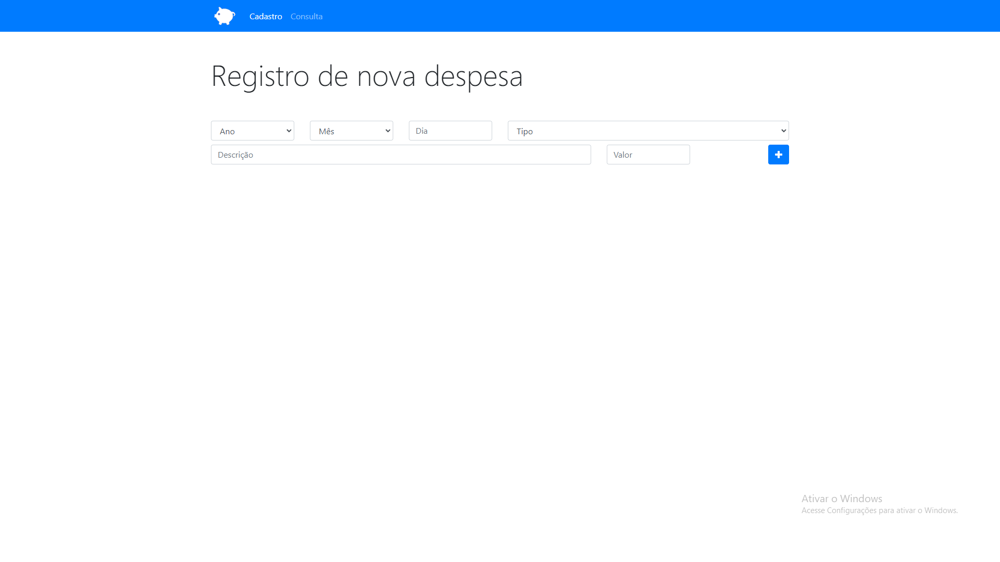
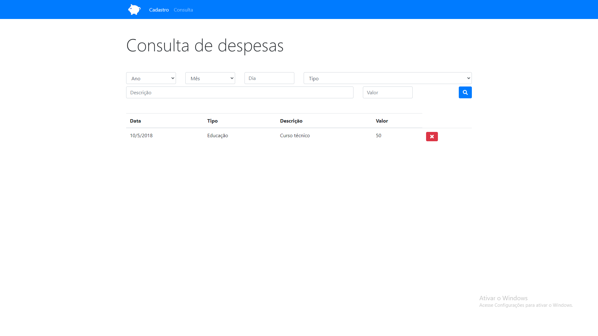

<h1>Projeto Cadastro de despesas </h1>

##  📝  Descrição do projeto 

 Este projeto foi criado para auxiliar o usuário no controle de suas despesas, podendo centraliza-las em um só lugar. 
 Possui funcionalidades como filtrar as despesas registradas por data, mês ou ano para melhor controle do usuário.
 Layout totalmente responsivo, e despesas sendo salvas no "local storage" do browser
  

## Linguagens, dependencias e libs utilizadas :books:

- HTML5
- CSS3
- JavaScript
- Bootstrap4

